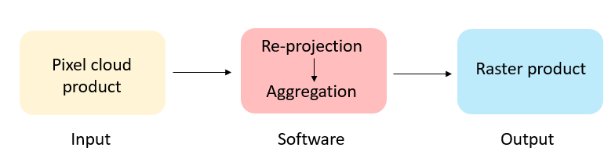
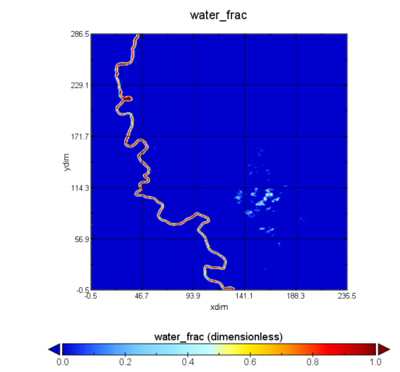

# Raster

This is a package written by [Alexander Corben](mailto:alexander.t.corben@jpl.nasa.gov) (JPL) and Shuai Zhang (UNC) to produce a raster image product from SWOT pixel-cloud data. The code is currently maintained by the SWOT Algorithm Definition Team.

# Usage

For generating data products that are most similar to the SWOT project's data products, the following script is recommended (found in src/bin):
```
usage: swot_pixc2raster.py [-h] [-pv PIXCVEC_FILE] [-id INTERNAL_FILES_DIR]
                           pixc_file alg_config_file runtime_config_file
                           out_file
```
where ```pixc_file``` is the SWOT high-resolution pixel-cloud data product, ```alg_config_file``` is the algorithmic configuration file, ```runtime_config_file``` is the runtime configuration file, and ```out_file``` is the filename of the output raster data product. See [this_link](https://github.com/SWOTAlgorithms/Raster-Processor/blob/develop/src/bin/swot_pixc2raster.py) for the recommended configuration. Additionally there are some optional arguments: ```-pv PIXCVEC_FILE``` will specify a pixel-cloud vector data product to use for aggregation of ice flags and improved height-constrained geolocation if commanded in the algorithmic configuration file, and ```-id INTERNAL_FILES_DIR``` will specify a directory in which internal files will be written.

The software is dependent on the open source RiverObs code at https://github.com/SWOTAlgorithms/RiverObs and the SWOT Hydrology Toolbox at https://github.com/CNES/swot-hydrology-toolbox.

# Processing Information



Fig. 1. Flowchart

The first step to convert pixel-cloud product to raster is re-projection (Fig. 1). Pixels under GEO lat/lon are re-projected to the appropriate UTM projection. Since each raster grid may contain multiple pixel-cloud pixels, an aggregation operation is needed specific to each output variable layer. The aggregation operations for water surface elevation and water area are provided here.

## Water surface elevation and water area

The equation for calculating water surface elevation in raster product is in equation (1), where wse_i is the water surface elevation of the ith grid in raster product. wse(x) is the water surface elevation for pixel-cloud pixel x, which is assigned to the ith grid in raster product. N is total number of pixel-cloud pixels which are assigned to the ith grid of raster product (N can be calculated through re-projection).

wse_i=(∑_x wse(x))/N
	(1)
The aggregations of water area are different for interior water pixels and edge pixels (Williams 2018). The water areas of interior water pixels are aggregated directly over a raster grid. The areas of water pixels near land and land pixels near water are calculated using a water-fraction based approach. The calculation can be expressed as equation (2),

A_i=∑_x A(x)(I_(dw,in) (x)+α(x)I_de (x))
	(2)

where Ai is the water area of the ith raster grid. Idw,in(x) stands for interior water pixels from pixel-cloud products, and Ide(x) indicates edge pixels of pixel-cloud products. A(x) is the area of pixel-cloud pixel, α(x) is the water fraction of edge pixel in pixel-cloud product. An example of water fraction over Sacramento river in Fig. 2 shows the water fractions of the river centerline are usually higher than pixels along river edge. Note that water faction of some pixels may exceed 1 due to noise in the SWOT pixel cloud inundation extent calculation. At the current stage, we retain these values in the raster product so that the summation across many raster cells will remain unbiased.



Fig. 2 Water fraction on SWOT raster image over Sacramento river

## Uncertainty estimates

The uncertainty of water fraction and water surface elevation are quantified in the raster product by using the algorithm proposed by Williams (2018). The input variable needed for estimating the water surface elevation and water area uncertainties (e. g. probability of detecting water when there is no water, missed detection rate, correct detection rate) are provided in the pixel-cloud product.

## References

B. Williams, “SWOT Hydrology Height and Area Uncertainty Estimation,” Jet Propulsion Lab, Tech. Rep., 2018.
